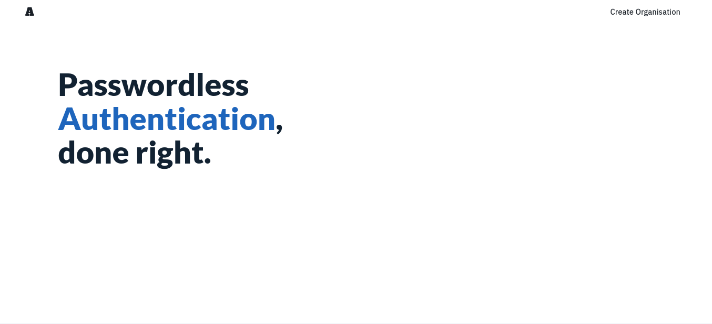
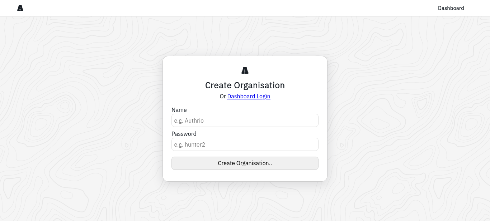

# haycss

Material Design made simple, by [Authrio](https://gitlab.com/authrio).

## Screenshots

<!-- authrio demo -->
Authrio Designs:

## Usage

Coming soon as haycss is still in early development, stay tuned!
